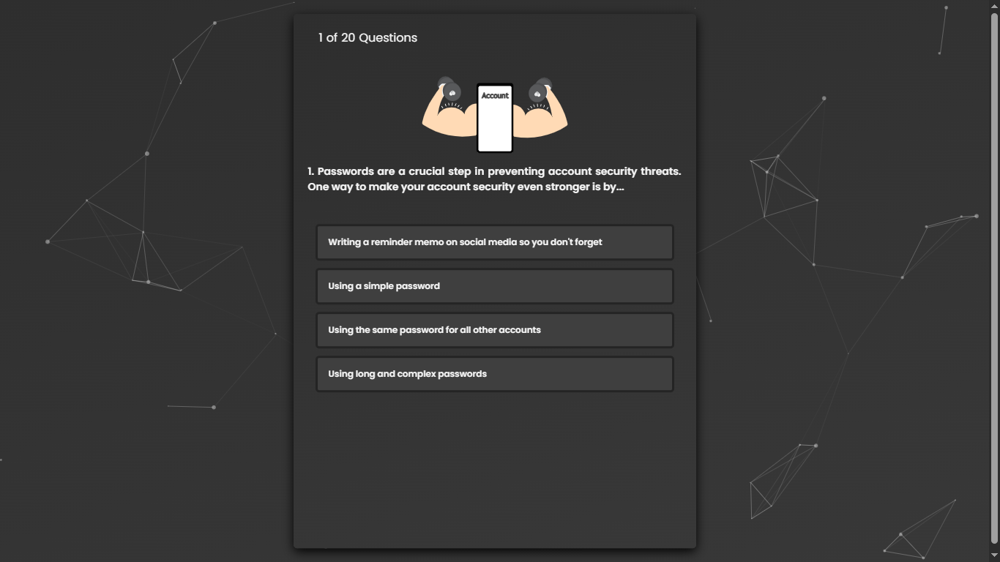

# Cyber Security Simple Quiz
An interactive, dark-mode cybersecurity simple quiz web focused on digital safety education.



## 🚀 Live Demo
You can try the quiz here: https://niluebutterfly.github.io/Cyber-Security-Simple-Quiz-Web/

## Features
- **Dynamic UI:** An animated particle background using `particles.js`.
- **Audio Experience:** Immersive background music and sound effects for correct/incorrect answers.
- **Illustrative Quiz:** Each question includes a unique vector illustration to boost engagement.
- **Explanation Mechanism:** Provides detailed responses for every choice made by the user.
- **Scoring System:** Earn 5 points per correct answer.
- **Visual Rewards:** Confetti animation triggered upon achieving a high score.
- **Responsive Design:** Optimized for both desktop and mobile viewing.

## Quiz Rules
- You can only select **one answer** per question.
- You need to answer a total of **20 questions**.
- You will receive **5 points** for each correct answer.
- Bonus: Try to get a score above 80 to see the special celebration!

## 🛠️ Tech Stack
- **Frontend:** HTML5, CSS3, JavaScript (ES6+)
- **Libraries:**
   - [Particles.js](https://vincentgarreau.com/particles.js/) - Interactive background particles.
   - [Confetti.js](https://github.com/catdad/canvas-confetti) - Celebration animations.
   - [FontAwesome](https://fontawesome.com/) - Iconography.

## Project Structure
```text
├── assets/
│   ├── confetti.js-master    # Confetti library
│   ├── css/                  # Custom styles (style.css)
│   ├── js/                   # Logic (script.js, questions.js)
│   ├── img/                  # SVG Illustrations and logo
│   ├── sound/                # BGM and SFX (mp3/ogg)
│   └── particles.js/         # Particle library
├── index.html                # Main entry point
└── README.md
```
## **Developed by NiluEB Development**
